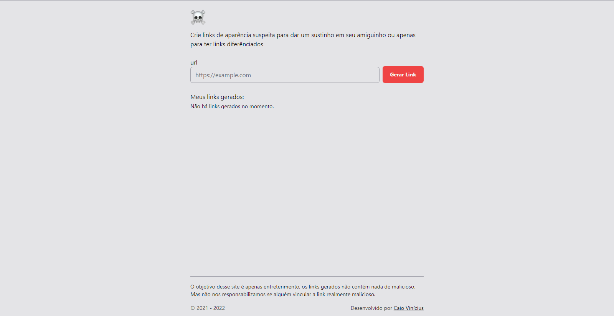

<h1 align="center">
  Gerador de Links Suspeitos
</h1>

  

## 🚀 Tecnologias

Esse projeto foi feito com as seguintes tecnologias:

- NextJS
- TailwindCSS
- Typescript

## 💻 Projeto

O _Gerador de Links Suspeitos_ ( ou como acho mais legal de falar, **SusLink** ) é apenas um site com o objetivo de gerar alguma url com uma aparência maliciosa. Mas é apenas para entreterimento, não que vá realmente ter algo de ruim.
